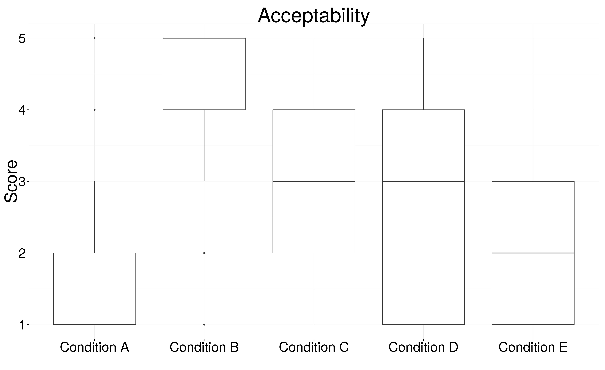
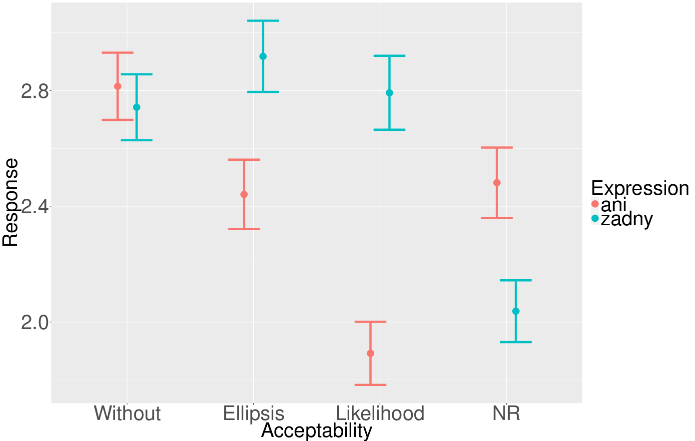
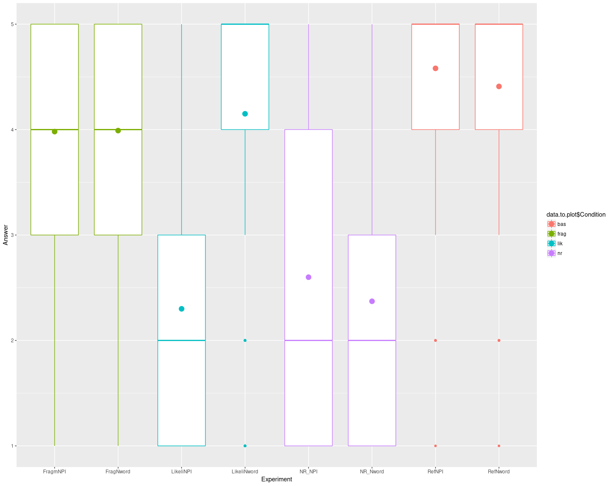
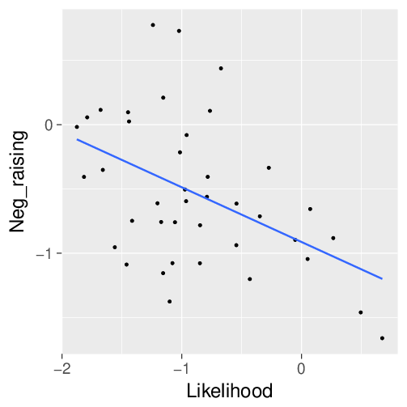
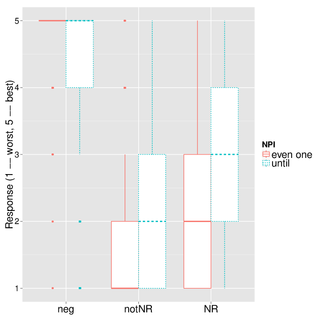

# Intro

## N-words vs. NPIs

- many languages distinguish

1) syntactically negative dependentent expressions: **n-words**

2) semantically negative dependent expressions: **N(egative) P(olarity) I(tems)**

\ex. \ag. **Nimeni** nu a venit.  
 n-person not has come  
 'Nobody came.'
\bg. \* **Vreun** student nu a venit.  
 NPI student not has come  
 '\*Any student didn't come.'  \hfill [Ro]

----

\ex. \ag. Dhen idhe **kanenan** o Janis.  
 not saw NPI-person the John  
 'John didn't see anybody'
\bg. Dhen idhe **KANENAN** o Janis.  
 not saw n-person the John  
 'John didn't see anybody \emph{at all}.' \hfill [Gr]

- agreed **criterion** (recently @giannakidou2017landscape):

\ex. X qualifies as an n-word iff:
\a. X can be used with structures with sentential negation or other X with meaning equivalent to one $\neg$
\b. X provides a negative fragment answer.


## Outline

joint work with Jakub Dotlačil \includegraphics[scale=0.1]{include/pic.jpg} 

- slides: [http://bit.ly/2AYE6Yl](http://bit.ly/2AYE6Yl)

1) NPIs vs. n-words: theory

  - n-words
  - NPIs: types
  - Czech

2) Experimental evidence

  - NR
  - Fragment answers
  - Likelihood


# NPIs vs. n-words: theory

## Sorting the data

- Germanic negative quantifiers $\not\in$ n-words:

\ex. \a. John didn't see nobody.  \hfill [En]
 $\neg \exists x[Person'(x) \wedge \neg See'(John,x)]$
\b. John nikoho neviděl.  \hfill [Cz]
 $\neg \exists x[Person'(x) \wedge See'(John,x)]$

- NPIs $\neq$ n-words:

\ex. \a. Whom did you talk to?
\b. \*Anybody.

----

## n-words: 

1) non-negative indefinites (predicate at type $\langle e,t\rangle$) plus roofing requirement (@ladusaw1992expressing, @giannakidou1997landscape a.o.)
2) n-words as agreement markers $\leftrightarrow$ locality, licensed in syntax (@zeijlstra2004sentential, @zeijlstra2008negative)

- n-words (unlike indefinites or NPIs) need local negation (@giannakidou2017landscape):

\ex. \ag. Dhen prodhosa mistika [pu eksethesan [kanenan/\*KANENAN]]  
 Not betrayed.1sg secrets that exposed.3pl anybody/n-body  
 'I didn't revela secrets that exposed anybody.'

----

- n-words in Slavic languages: locality is very strict (@progovac1993negative), unlike in Spanish, Italian, Greek

\ex. \ag. \*Petr neřekl, že nikdo přišel.  
 Petr neg.said that n-body came  
 'Petr didn't say that anybody came.'
\bg. \*Petr nechce, aby tu nikdo byl.  
 Petr neg.wants C.subj here n-body were   
 'Petr doesn't want anybody were here.'

----

## NPIs

- *any* -- Negative Polarity Item (NPI)

\ex. \* Peter visited anyone.

\ex. Petr didn't visit anyone.
\a. $\neg \exists x[Person'(x) \wedge Visit'(Peter,x)]$

----

- NPI licensing expressions share the property of reversing the direction of entailment in their argument
- negation reverses entailment:


| p | q | (p $\wedge$ q) $\rightarrow$ (p $\vee$ q)  | $\neg$(p $\vee$ q) $\rightarrow$ $\neg$(p $\wedge$ q) |
|:-:|:-:|:------------------------------------------:|:-----------------------------------------------------:|
| 1 | 1 |                     1                    |                          1                          |
| 0 | 1 |                     1                    |                          1                          |
| 1 | 0 |                     1                    |                          1                          |
| 0 | 0 |                     1                    |                          1                          |

----

- natural language example:

\ex. red wine $\rightarrow$ wine
\a. John likes red wine. $\rightarrow$ John likes wine.
\b. John doesn't like red wine. $\not\rightarrow$ John doesn't like wine.
\c. John doesn't like wine. $\rightarrow$ John doesn't like red wine.

- general term: Downward Entailing (DE)

\ex. Fauconnier-Ladusaw’s Licensing Condition: An NPI is only grammatical if it is in the scope of an $\alpha$ such that $\llbracket \alpha \rrbracket$ is DE.

----

- upward monotonic quantifier: subsets $\rightarrow$ supersets
- downward monotonic quantifier: supersets $\rightarrow$ subsets

\ex. \a. det A: upward entailing iff for any B, C ($B \subseteq C$) $Det\ A\ B \Rightarrow Det\ A\ C$
\b. det A: downward entailing iff for any B, C ($B \subseteq C$) $Det\ A\ C \Rightarrow Det\ A\ B$
\c. if not upward or downward monotonic $\rightarrow$ non-monotonic

----

\ex. Upward/Downward entailing and Non-monotonic  determiners:
\a. some: Some toys are blue $\Rightarrow$ Some toys are colored
\b. few: Few toys are colored $\Rightarrow$ Few toys are blue
\c. exactly *n*: Exactly three toys are blue $\not\leftrightarrow$ Exactly three toys are colored 

----


- monotonicity properties of a position in a sentence are computed compositionally:


\ex. \a. [$\downarrow$ At most three detectives arrested $\downarrow$[fewer than four $\uparrow$[criminals]]]
\b. $\Rightarrow$[$\downarrow$ At most three detectives arrested $\downarrow$[fewer than four $\uparrow$[humans]]]


## Weak NPIs

- Downward Entailing scope/environment
- weak NPIs: *any, ever, ...*

\ex. \a. Bill didn’t **ever** say **anything**.
\b. No student **ever** said **anything**.
\c. Few students **ever** said **anything**.
\d. At most 5 students **ever** said **anything**.
\e.\*Between 5 and 10 students **ever** said **anything**.
\f. \*Some/\*all/\*most students **ever** said **anything**.


## Strong NPIs

- *in weeks*, additive *either*, and punctual *until*

\ex. \a. Bill didn’t leave **until his birthday**.
\b. No student left **until his birthday**.
\c. ??Few students left **until their birthdays**.
\d.\*At most 5 students left **until their birthdays**.
\e.\*Between 5 and 10 students left **until their birthdays**.
\f.\*Some/\*most/\*all students left **until their birthdays**.

----

\ex. Anti-additive function: $F(x \vee y) \leftrightarrow F(x) \wedge F(y)$

\ex. No student smokes or drinks $\leftrightarrow$ No student smokes and no student drinks.

\ex. Few students smoke or drink $\not\leftrightarrow$ Few students smoke and few students drink

- anti-additivity as necessary for Strong NPIs: @zwarts1998three
- popular alternative epxlanation: @gajewski2011licensing


## NPIs vs. n-words: modularity

- n-words vs. NPIs: syntax (agreement) vs. semantics (monotonicity, ...)
- goes well with modularity: distinguishing different forms of ill-formedness (syntactic, semantic, ...)
- logical properties correlating with syntactic acceptability (NPIs) $\rightarrow$ linking the domains
- some theories (Heim/Crnič) of NPIs licensing: via presupposition ($\rightarrow$ linking pragmatics and syntactic acceptability)

## Czech: "= 0" vs. "< 1"

- in Czech: two candidates both for NPI and n-word status:

\ex. \ag. Petr neviděl ani jednoho/žádného studenta.  
 Petr neg.saw even one/any student  
 'Petr didn't see any student.'
\b. \*Ani jeden/\*žádný student přišel.  
 Not even one/any student came.
\c. Petr neslyšel, že \*ani jeden/\*žádný student přišel.  
 Petr didn't hear that even one/any student came.

----

- the meaning (natural numbers) at first sight identical

\ex. \a. $\llbracket$ani jeden N$\rrbracket \approx \#(\llbracket N\rrbracket) < 1$
\b. $\llbracket$žádný N$\rrbracket \approx \#(\llbracket N\rrbracket) = 0/\neg(\llbracket N\rrbracket)$

- all four possibilities reasonable, Czech tradition (@havranek1960slovnik):

item/status       NPIs  n-words
----              ----  -------
\emph{ani jeden}   X    $\checkmark$ 
\emph{žádný}       X    $\checkmark$

\ex. Research question: do strict neg-concord languages even allow grammaticalization of Strong NPIs?


# Experimental evidence

## Neg-raising

- long distance licencing should be possible for NR (unlike for non-NR) in case of NPIs
- n-words in Slavic languages obey strict locality (syntax)
- predictions:

environment/status       NPIs         n-words
----                     ----         -------
NR embedded              $\checkmark$   X     
non NR embedded          X              X

- experiment 1: @dovcekal2016experimental

----

\ex. \ag. **Ztratila** se **ani** jedna ovce.  
 Lost SE not-even one sheep  
 ‘A single sheep is missing.’ 
\bg. **Neztratila** se **ani** jedna ovce.  
 neg-lost SE not-even one sheep  
 ‘Not a single sheep is missing.’
\c. Nový bača v Tatrách **nechce**, aby se ztratila **ani** jedna ovce.  
 new shepherd in Tatras neg-wants C SE lost not-even one sheep. 
\d. Nový bača v Tatrách si **nemyslí**, že se ztratila **ani** jedna
ovce.  
 new shepherd in Tatras SI neg-think C SE lost not-even one sheep
\e. Nový bača v Tatrách **neříká**, že se ztratila **ani** jedna ovce.  
 new shepherd in Tatras neg-say C SE lost not-even one sheep

----

- 5 environments

(A) a positive sentence (A)
(B) a negative sentence (B)
(C) a clause embedded under negated NR predicates of intention and judgement/obligation
(e.g. *want, advise*) (C)
(D) a clause embedded under negated NR predicates of opinion (*believe*) (D)
(E) non-NR predicates (E)

- only *ani jeden*

----

 

----

- the scalar approach to NR (@horn1973semantic, @romoli2012soft, @romoli2013scalar)
- NR predicates (beside the assertion -- \Next[a]) contribute the excluded middle (EM) to the semantic composition (\Next[b]): 
- alternatives are exhaustified by EXH -- \NNext

\ex. \a. $\llbracket P \rrbracket = \lambda p\lambda x.\square_x[p]$
\b. $Alt(NR)=\{\lambda p\lambda x.\square_x[p],\lambda p\lambda x.[\square_x[p] \vee \square_x[\neg p]]\}$

\ex. $EXH(Alt(p))(p)(w) = p(w) \wedge \forall q \in Excl(p,Alt(p))[\neg q(w)]$

----


\ex. ‘A new shepherd in Tatra mountains doesn’t want even one sheep to be
missing.’ $\neg want_s[p]$ .

\ex. \a. $Alt(\neg want_s[p])=\{\neg want_s[p], \neg(want_s[p] \vee want_s[\neg p])\}$
\b. $\llbracket EXH\rrbracket (\neg want_s[p])=\neg want_s[p] \wedge \neg \neg(want_s[p] \vee want_s[\neg p]) \models want_s[\neg p]$

- consequence of exhaustification of NR: negation is interpreted as having low scope (semantically)

----

- recall: strong NPIs are licensed by anti-additive functions

\ex. \a. It didn't rain and it didn't snow.
\b. It didn't rain or snow. 
\c. $\neg p \wedge \neg q$
\d. $\neg[p \vee q]$

----

- the same for NR predicates (like *want*)

\ex. \a. Susan does not want to sleep and she does not want to dance.
\b. Susan does not want to sleep or dance.
\c. $\square \neg p \wedge \square \neg q \leftrightarrow$
\d. $\square \neg(p \vee q)$

world/proposition|p|q
-----------------|-|-
w$_1$         |   0|0
w$_2$           | 0|0

----

- not NR predicates (like *say*): \Next[b] does not follow from \Next[a]
- not-NR are not antiadditive and not able to license strong NPIs


\ex. \a. Susan didn't say that she will sleep and she didn't say that she will dance.
\b. Susan didn't say that she will sleep or dance.

\ex. \a. $\neg \square p \wedge \neg \square q$ (true in the table)
\b. $\neg \square[p \vee q]$ (false in the table)

world/proposition|p|q
-----------------|-|-
w$_1$         |   0|1
w$_2$           | 1|0


----

- initial predictions 

environment/status       NPIs         n-words
----                     ----         -------
NR embedded              $\checkmark$   X     
non NR embedded          X              X

- experimental support of clasiffying *ani jeden* as strong NPI

----

## Fragment answers

- the distinction between n-words and Strong NPIs
- in the experiment 3 we observed negative interaction of *ani* and ellipsis in non-negative questions:

\ex. Kdo odešel z hospody?  
 who left from pub? 
\a. Žádný student.  
 n-ADJ student
\b. ??Ani jeden student.  
 NPI one student

----




----

- but in Experiment 4 (more context informations) the correlation disappeared:

\ex. Koho vyhodil profesor Palný včera ze zkoušky?  
 whom fired prof Palný yesterday from exam?
\a. Žádného studenta.  
 n-ADJ student
\b. Ani jednoho studenta.  
 NPI one student

----



----


- usually taken as the standard test of being n-word (vs. NPIs)
- @fualuauș2016fragment observes that in strict neg-concord languages n-word answers to negative questions can have (surprisingly) Double Negation (DN) reading:
- against the n-words vs. NPIs criterion (two negations)

\ex. Kdo nepřišel na party? Nikdo.  
 who neg.came to party n-person
\a. NC-reading: $\neg \exists x[Person'(x) \wedge ComeParty'(x)] \equiv \forall x[Person'(x) \rightarrow \neg ComeParty'(x)]$
\b. DN-reading: $\neg \exists x[Person'(x) \wedge \neg ComeParty'(x)] \equiv \forall x[Person'(x) \rightarrow ComeParty'(x)]$

----

- Slavic speakers (Czech, Slovak, Russian) judgments confirm this (small survey: 10 students)
- slight preference (7/10) for NC reading
- **new data**: DN is strengthened by pressence of other n-word(s)

\ex. Kdo nepřečetl žádný článek? Nikdo.  
  who neg.read n-ADJ article n-person
\a. NC (2/10): $\forall x[Person'(x) \rightarrow \neg \exists y[Article'(y) \wedge Read'(x,y)]]$
\b. DN (8/10): $\forall x[Person'(x) \rightarrow \exists y[Article'(y) \wedge Read'(x,y)]]$

----

- the same pattern is observed even in **affirmative** sentences (**new data** in Slavic languages):

\ex. Nikdo ničemu nevěří.  
 n-person n-thing neg.believes
\a. NC: $\forall x[Person'(x) \rightarrow \neg \exists[Entity'(y) \wedge Believes'(x,y)]]$
\b. \*DN: $\forall x[Person'(x) \rightarrow \exists[Entity'(y) \wedge Believes'(x,y)]]$

\ex. V nic nikdo nevěří.  
 in n-thing n-person believes
\a. NC (0/10): $\forall x[Person'(x) \rightarrow \neg \exists[Entity'(y) \wedge Believes'(x,y)]]$
\b. DN (10/10): $\forall x[Person'(x) \rightarrow \exists[Entity'(y) \wedge Believes'(x,y)]]$

----

- similarly:

\ex. Nikdo při té zkoušce nic nenapsal.  
 n-person at the exam n-thing neg.wrote
\a. NC (10/10): $\forall [... \neg  \exists ...]$
\b. DN (0/10): $\forall [... \exists ...]$

\ex. Nic při té zkoušce nikdo nenapsal.  
 n-thing at the exam n-person neg.wrote
\a. NC (0/10): $\forall [... \neg  \exists ...]$
\b. DN (10/10): $\forall [... \exists ...]$

----

- assumption (after @fualuauș2016fragment): such data $\rightarrow$ evidence for a focus position in the left-periphery of Slavic clause where n-words can license Covert Negation (CN)
- constraints: presence of another n-word(s) plus in same cases ellpisis (but not the sine qua non condition)

$\rightarrow$ double negation reading: $\llbracket CN\rrbracket = \neg + \llbracket SN\rrbracket = \neg$

\ex. $\Tree[[.CN ] [[.FOC n-word ][.TP [] [.NegP [. SN ] [.VP [.V ] n-word ]]]]]$

----


- inconclusive evidence: both from experiments and DN data
- some other factor: left peripheral position licensing second negation but parasitic on SN?
- have to be constrained:

\ex. \*V nic Petr věří.  
 in n-thing Petr believes

- plan: investigate DN readings w.r.t. n-words/Strong NPIs
- prediction: n-words should be preferred

----


## Likelihood scenarios

- n-words vs. NPIs w.r.t. semantic properties
- predictions:

  1) n-words (syntax) shouldn't be sensitive to logical properties of their environment (just sentential/verbal negation)
  2) NPIs licensed in semantics by definition are

----

- very influental current theory of NPI licensing -- **simple *even* hypothesis of NPI licensing** (@heim1984note, @krifka1995semantics, @crnivc2014against):

  - NPIs associate with covert *even*
  - NPIs (and focus) generate sets of possible alternatives
  - covert *even* associates with the alternatives and generates presupposition of its prejacent being the least probable member of the set of alternatives

- predictions of Heim/Crnič theory: NPIs should be sensitive to probability

property/item |  probability
----          |------------
n-words       |\*
NPIs          |$\checkmark$

----

- we tested exactly this prediction in Experiment 3 and Experiment 4
- in both we found strong correlation of *ani* and probability
- side-note: all natural examples of *ani*: most likely situations (ČNK) in the un-negated form and least probable in the negated form:

\ex. tento nyní úspěšný podnikatel [...] v prvním měsíci neměl ani jednoho zákazníka  
 this now very succesfull businesman [...] in first month didn't have [NPI one customer]

----

- Experiment 3: *ani/žádný* in likely (negated) sentences

\ex. (...) nestal se **ani/žádným** kardinálem  
 'He didn't become even a cardinal.'

- people strongly preferred *žádný* (n-word)
- it doesn't clash with the least likely presupposition of *ani*

----


----

- Experiment 4: ellaboration
- truth value judgment task
- example item (B.A. pass the exam: most unlikely, B.A. fail the exam most likely -- negated *ne-složili*):

\ex. Scenario: prof. Novák yesterday examined an easy course which B.A., M.A. and Ph.D. students attend. Ph.D. students pass the exam always, M.A. in most cases but B.A. only seldomly.
\a. Včerejší zkoušku u prof. Nováka nesložili **ani/žádní** bakaláři.  
 yesterday exam at prof. Novák neg.passed NPI/n-Adj B.A.-students


----


----

- and again we found strong preference for *žádný* (n-word) in most likely scenarios (collision with least likely *ani* (NPI) presupposition)
- conclusion:

property/item |  probability
----          | ------------
*žádný*       |    \*
*ani*         |    $\checkmark$


----

- theoretical explanation (least probability):

\ex. $\llbracket even\rrbracket ^w (C)(p)$ is defined only if $\forall q \in C[q \neq p \rightarrow q >_{likely} p]$

- scope of covert *even* over *ani* (plus anti-additivity requirement):

\ex. [even C] [$\downarrow$ $\neg$ [$\uparrow$ ...  ani ...]]

\ex. [even C] [$\downarrow$ $\neg$ [$\uparrow$ ... ani BA passed   ...]]

----

## Correlations and dialectal variation

- the evidence to consider *ani* a strong NPI is very limited
  - the only positive evidence: it might appear under negated NR predicates
- Question 2:

\ex. Could speakers differ w.r.t. their categorisation of *ani*?

----

- Experiment 3: we checked whether *ani* correlates with \cond{Likelihood}/\cond{NR} conditions
- some speakers might accept \cond{likelihood} if *ani* is an n-word for
them; 
- the same speakers should reject \cond{NR} with *ani* 
- a nearly significant negative correlation between such-constructed \cond{Likelihood} and \cond{NR} ($t=-1.9, p = .065$):

dialectal variation | condition | preference
--------|-----------|-----------
correlation A | \cond{NR} | *ani* $\approx$ n-words
correlation A | \cond{likelihood} | *ani* $\approx$ n-words
correlation B | \cond{NR} | *ani* $>$ n-words
correlation B | \cond{likelihood} | *ani* $<$ n-words

- correlation B: *ani* strong NPI, correlation A: *ani* n-word

----

Experiment 4:

- more ellaborated context (B.A. vs M.A. & Ph.D.)
- scales: logically stronger $\rightarrow$ least likely (Kolmogorov)
- plus logically independent but contextually manipulated propositions: restaurant and customers (tourists >$_{likely}$ bureaucrats >$_{likely}$ students): clash of most likely in the context plus *ani* least likely presupposition

\ex. nenavštívili ani studenti  
 neg.visited ani students

- a strong effect: negative correlation of (z-transformed) *ani* acceptability in NR with likelihood (*t*=-3.2, *p*=.003)

----




----

- points: mean value of each subject answers
- blue line: regression line
- NR as a function of Likelihood minimizing residuals
- subjects either:
  - observed *ani* presupposition and allowed NR with *ani*
  - allowed presupposition failure and didn't accept NR with *ani*
  - (no top right corner): no subject allowed presupposition failure of *ani* and allowed NR with *ani* 
- stronger effect in experiment 4 than in experiment 3

----

## Correlations and dialectal variation summary

1) Speakers more aware of likelihood presupposition of *ani* prefer it to n-words in NR (negative correlation of likelihood and NR)
2) Speakers more relaxed with *ani* presupposition failure do not differentiate it from n-words
3) Strong NPIs are licensed semantically via likelihood presupposition

----


## Summary

- n-words and strong NPIs co-exist in natural language
- even strict neg-concord languages distinguish Strong NPIs and n-words
- n-words are licensed syntactically
- NPIs in semantics/pragmatics: antiaditivity + likelihood presupposition (direct evidence for Heim/Crnič type of theory)
- the domains are more linked then strict modularity predicts
- such subtle date can only be dealt with experimental methods

# Thanks!

# Appendix

## Experiment 1 (NR)

- 40 exp. items in part 1 and 20 exp. items in part 2: 60 tested sentences
- each part 30 fillers, 60 Czech native speakers, $\approx$ 1 hour
- the experiment online in Ibex: [link](http://spellout.net/ibexexps/mojmir/nr_3_2015/experiment.html)

## Results of acceptability task

- all participants passed control fillers (uncontroversially grammatical/ungrammatical)
- **acceptability** task: modeled by mixed-effects ordered probit regression
- Condition C as the reference level
- negated sentences, Condition B, were judged as better than NRs ($\beta=1.84, z=23, p<.001$)
- positive sentences, Condition A, were judged as worse than NRs ($\beta=-1.1, z=-15,p<.001$)
- sentences with negated non-NR (E) predicates worse than any NR ($\beta=-0.65, z=-9, p<.001$)
- evidence for: 
1) treating *ani* ‘not even’ and *až do* 'until' as a strict NPIs 
2) Czech has a class of NR verbs.

----

## Experiment 2


Mixed-effects probit models to analyze the data with mood (subjunctive vs. indicative), predicate type (opinion, probability, communication) and their interaction as fixed effects

-  NR predicates (\ref{ex:nr1} and \ref{ex:nr2}) judged as significantly better than non-NR communication predicates \ref{ex:non-nr} -- \textit{z} = -2.51, \textit{p} = 0.012
- no difference between opinion and probability NR predicates
- subjunctive mood better than indicative mood (\textit{z} = 2.39, \textit{p} = 0.017)
- strict NPIs (\textit{ani jeden} 'not even one') judged as worse than HSEs (\textit{až do} 'until') with NR predicates (\textit{z} = 2.65, \textit{p} = 0.008)


----

**Post-hoc analysis of two types of strict NPIs**

- 'even one' was fully acceptable in sentences with clause-mate negation but degraded with negated NR predicates ($\beta = -4.7, z = 10.4, p < .001$) -- \Next[a] (one of the items in two conditions) 
- with non-NR predicates (\Next[b]) 'even one' was judged as worse than with NR predicates ($\beta = -1.1, z = 5.7, p < .001$).

\ex. \ag.\label{ex:even_simple}Náš nový knihovník si nepřeje, aby zmizela ani jedna kniha.  
 our new librarian SE neg-wishes C lost even one book  
 'Our new librarian doesn't wish even one book to be missing.'
\b.\label{ex:until_simple} Náš nový knihovník neslyšel, že zmizela ani jedna kniha.  
 'Our new librarian didn't hear that even one book was lost.'

---

- 'until' behaved strangely differently: significantly less acceptable in sentences with clause-mate negation compared to 'even one' ($\beta = -3.2, z = -6.4, p < .001$)  
- even more surprisingly 'until' was more acceptable than 'even one' with NR predicates ($\beta = 0.6, z = 2.6, p < .01$) -- \Next[a]

----

## Experiment 3


- We analyzed the data in a mixed-effects linear
model with subject and item intercept+slope random effects. 
- The
dependent variable was a by-subject z-transformed response.
- The
independent variables were \cond{environment} (ref-level:  \cond{without}), \cond{expression}, (ref-level: \cond{žádný}) and their
interaction. 

---


- The model
also revealed a negative interaction of \cond{ani} by \cond{ellipsis} and \cond{likelihood} ($t=-2.6, p<.05, t=-4.7, p<.001$) 
- The interactions show that *ani*
is worse in ellipses/the likelihood constructions than n-words, but it is better under NR predicates than n-words


schematic structure | preference | condition
--------------------|------------|----------
A: Subj V? B: ... | n-word $>$ *ani jeden* | \cond{ellipsis}
Subj V ... | n-word $>$ *ani jeden* | \cond{likelihood}

- We found a negative main effect of \cond{NR} ($t=-4.1, p<.001$): n-words in NR are significantly worse than in the reference level condition, \cond{without}


---

- and a
positive interaction of \cond{ani} by \cond{nr} ($t=2.4, p<.05$): *ani (jeden)* is far more acceptable than n-words in: 

schematic structure | preference | condition
--------------------|------------|----------
[Subj $\neg$NR-V [emb-V ...] | *ani jeden* $>$ n-word | \cond{NR}


---

### Summary

- The results taken
together strongly support the position that:

1) *ani (jeden)* ‘even (one)’
is a strong NPI and not an n-word 

2) strong NPIs co-exist with
n-words in Czech. 

---


## Predicative position

\ex. \a. Petr není žádný lékař.
\b. \*Petr není ani jeden lékař.

- $\neg doctor(petr)$

\ex. Petr a Marie jsou 2 lékaři.  
 $X=*doctor \wedge \#(X)=2 \wedge X(Petr \sqcup Marie)$

----

- *ani jeden* vs. *žádný* in predicative (and possibly idiomatic) positions:

\ex. \*Petr není ani jeden lékař.  
 $X=*doctor \wedge \#(X) < 1 \wedge X(Petr)$

\ex. Petr nekupoval žádného/???ani jednoho zajíce v pytli.  
\a. $\neg BuyRabitInSack(Petr)$
\b. $\neg K(P,X) \wedge X=RabitInSack \wedge \#(X) < 1$


## Strong NPIs are not one homogenous class

- *ani jeden* vs. *až do*
- *až do* better unlike *ani jeden*
 acceptability of sentences with strict NPIs, *ani jeden* 'even one' and HSE *až do* 'until' + time expression 
- three predicate types: \Next opinion class of NRs, \NNext probability class of NRs, \ref{ex:non-nr} non-NR communication predicates
- each environment was varied for the mood of the predicate in the embedded clause (indicative mood vs. subjunctive mood)
- 36 exp. items in 2x3 (=6) conditions + 36 fillers

----

\exg.\label{ex:nr1}Nemyslím, že 0/by ani jeden z běžců může/mohl ten závod vyhrát.  
 do-not-think-I that IND/SUBJ even one of runners can/could the race win    
 'I don't think that even one of the runners can/could win the race.'

\exg.\label{ex:nr2}Není možné, že 0/by ani jeden z běžců může/mohl ten závod vyhrát.  
 it's-not possible that IND/SUBJ even one of runners can/could the race win    
 'It's not possible that even one of the runners can/could win the race.'

\exg.\label{ex:non-nr}Netvrdím, že 0/by ani jeden z běžců může/mohl ten závod vyhrát.  
 do-not-say-I that IND/SUBJ even one of runners can/could the race win    
 'I don't say that even one of the runners can/could win the race.'


---

- 'even one' behaved like a strict NPI: fully licensed by the clause-mate negation
- licensed by a non-local NR negation but hardly acceptable with a non-local non-NR negation (not anti-additive)
- 'until' behaved strangely differently: significantly less acceptable in sentences with clause-mate negation compared to 'even one' 

----



----

Conclusion: 

- *ani jeden* is strong NPI
- *až do* aspectually sensitive expression which requires its local predicate to be homogeneous 
  - most frequent occurrences of Czech 'until' in the SYN2010 corpus: upward entailing with imperfective verbs

----

## Experiment 4

- Cumulative Link Mixed Model fitted with the Laplace approximation

```{r eval=FALSE}
formula: as.factor(Answer) ~ Condition + (1 | Subject) + (1 | Item)
data:    datalik

 link   threshold nobs logLik  AIC    niter     max.grad cond.H 
 probit flexible  320  -403.53 821.07 459(1422) 5.97e-04 1.3e+02

Random effects:
 Groups  Name        Variance Std.Dev.
 Subject (Intercept) 0.3482   0.5901  
 Item    (Intercept) 0.1229   0.3505  
Number of groups:  Subject 40,  Item 16 

Coefficients:
               Estimate Std. Error z value Pr(>|z|)    
Conditionlik-a  -1.6706     0.2313  -7.221 5.14e-13 ***
---
Signif. codes:  0 ‘***’ 0.001 ‘**’ 0.01 ‘*’ 0.05 ‘.’ 0.1 ‘ ’ 1

```

----

## References{.allowframebreaks}

\scriptsize
